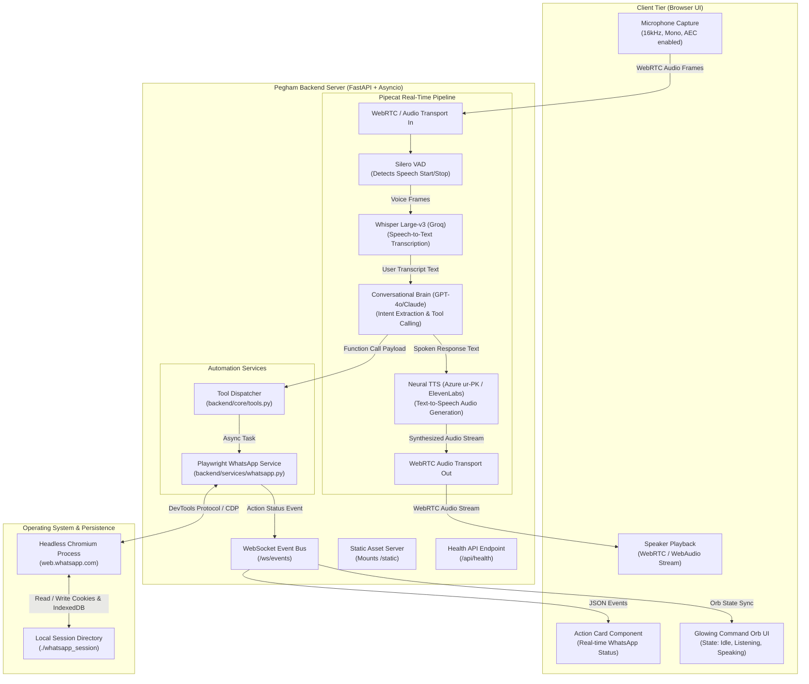
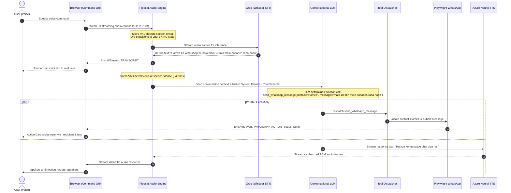
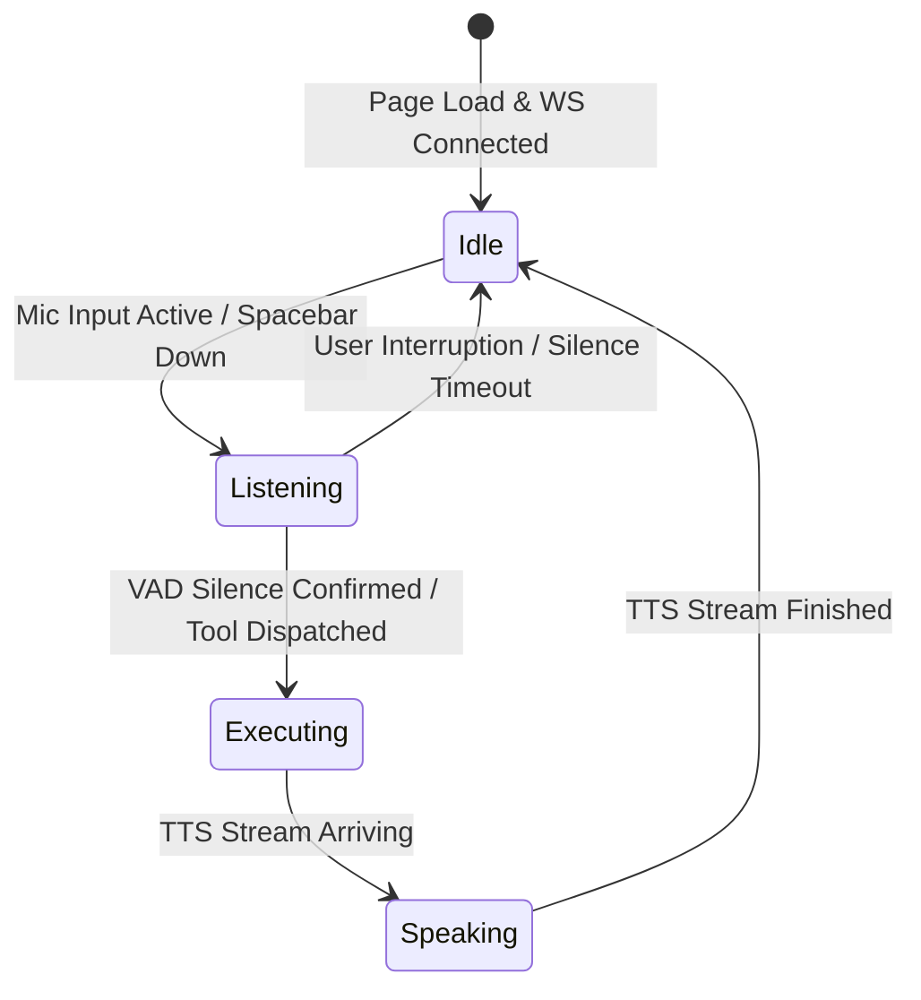

# 01 — System Architecture & Data Flow

This document details the architectural topology, data pipelines, event loops, and latency budgets that allow **Pegham.ai** to deliver sub-second, voice-driven WhatsApp automation.

---

## 🏛️ System Topology Diagram

Pegham.ai operates on a client-server architecture hosted locally on the user's workstation. The diagram below illustrates the components and their boundaries:

---

## 🔄 End-to-End Voice-to-Action Lifecycle

When a user says: *"Hamza ko WhatsApp pe bolo main 10 min mein pohanch raha hoon"*, the system executes the following chronological sequence:

---

## ⏱️ The 800ms Latency Budget

In voice user interfaces (VUI), human conversational psychology dictates that **any response taking longer than 1,000ms creates an awkward, robotic pause**.

Pegham targets an **end-to-end turnaround latency under 800ms**. Here is how the latency budget is partitioned:

| Processing Stage | Target Latency | Optimization Technique |
| :--- | :---: | :--- |
| **1. Audio Ingestion & Transport** | $\approx 20\text{ms}$ | Browser WebRTC Opus stream over local `localhost` network. |
| **2. Voice Activity Detection (VAD)** | $\approx 350\text{ms}$ | Silero VAD chunking. Requires ~350–400ms of consecutive silence to confirm user finished speaking without cutting off thought pauses. |
| **3. Speech-to-Text (STT)** | $\approx 150\text{ms}$ | Whisper Large-v3 running on Groq LPUs (capable of 300+ words per second transcription). |
| **4. LLM Time to First Token (TTFT)** | $\approx 200\text{ms}$ | Streaming completion using low-latency reasoning models with zero pre-prompt fluff. |
| **5. Text-to-Speech First Chunk** | $\approx 100\text{ms}$ | Azure Neural TTS streaming endpoint emitting chunked audio frames as tokens arrive. |
| **Total Turnaround to Voice Output** | **$\approx 820\text{ms}$** | **Sub-second, human-like voice response.** |

> [!NOTE]
> The WhatsApp Playwright automation executes **concurrently** with the audio response synthesis. The user hears the spoken confirmation *"Hamza ko message bhej diya hai"* at the exact instant the browser DOM action finishes submitting the message.

---

## 🚦 Frontend State Synchronization Machine

The Command Orb in `frontend/js/app.js` is driven by a finite state machine synchronized over WebSockets:

1. **`orb-idle` (Emerald Green):** System is ready and waiting for microphone activation.
2. **`orb-listening` (Electric Indigo Pulse):** Silero VAD detects active speech; pulse expands with user's voice cadence.
3. **`orb-executing` (Amber Glow):** WhatsApp automation is clicking contacts and typing text in Chromium.
4. **`orb-speaking` (Teal-Blue Wave):** The assistant is actively speaking confirmation back to the user.
