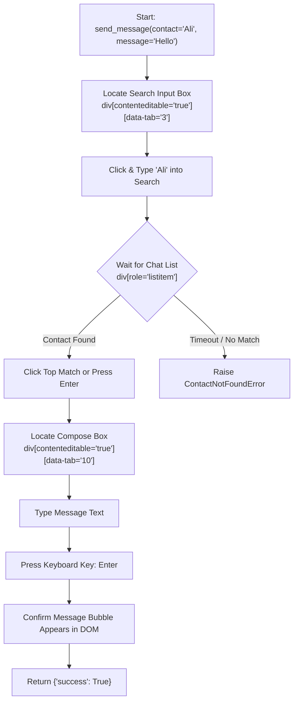

# 04 — Playwright WhatsApp Automation Mechanics

This document provides a deep technical examination of how **Pegham.ai** controls WhatsApp Web using Playwright, how browser authentication state is persisted without cloud APIs, and how bot-detection countermeasures are mitigated.

---

## 🍪 How Chromium Persistent Contexts Work

When a standard browser window opens, it loads session cookies, cryptographic keys, and cache files from a user profile directory on your disk.

Standard automation scripts (e.g. basic Selenium or `playwright.chromium.launch()`) create an **ephemeral (incognito) profile** in a temporary folder that is completely destroyed when the script finishes.

Pegham instead uses **persistent contexts**:
```python
context = await playwright.chromium.launch_persistent_context(
    user_data_dir=str(settings.session_path), # Points to ./whatsapp_session
    headless=False,
    args=[
        "--no-sandbox",
        "--disable-setuid-sandbox",
        "--disable-blink-features=AutomationControlled",
    ],
    viewport={"width": 1280, "height": 800}
)
```

### What Is Stored Inside `./whatsapp_session`?
When you scan the QR code via `scripts/setup_whatsapp.py`, Chromium populates the following directory structure:

* **`Default/Cookies` (SQLite DB):** Stores active session cookies from `web.whatsapp.com`.
* **`Default/IndexedDB/https_web.whatsapp.com_0.indexeddb.leveldb/`:** **This is the most critical folder.** WhatsApp Web uses IndexedDB to store Signal protocol cryptographic keypairs, chat lists, and contact metadata.
* **`Default/Local Storage/leveldb/`:** Stores client settings, dark mode preferences, and device registration identifiers.
* **`Default/Service Worker/`:** Caches WhatsApp Web script bundles and handles push sync.

Because this directory is retained locally on your disk, any subsequent launch of Chromium with `user_data_dir="./whatsapp_session"` automatically restores the authenticated WhatsApp session **without requesting a QR scan again**.

> [!CAUTION]
> The `./whatsapp_session` folder contains sensitive cryptographic keys that grant complete access to your WhatsApp account.
> **Never commit this directory to Git.** Ensure `.gitignore` contains `whatsapp_session/`.

---

## 🛡️ Anti-Bot Detection & Fingerprint Mitigation

WhatsApp Web actively monitors browser characteristics to detect automated scraper bots. If a bot signature is detected, WhatsApp may display an infinite loading spinner or temporarily log out the session.

Pegham mitigates this through three techniques:

### 1. Disabling `navigator.webdriver`
By default, automated Chromium instances set the JavaScript property `navigator.webdriver = true`. WhatsApp's JavaScript checks this flag on boot.
Pegham disables this flag via:
```python
args = ["--disable-blink-features=AutomationControlled"]
```

### 2. Realistic Viewport & User-Agent
Bots often launch with `0x0` viewports or generic headless dimensions. Pegham launches with a realistic desktop viewport (`1280x800`) and standard desktop window properties.

### 3. Humanized Typing & Delays
Instead of setting `element.value = "message"` directly via DOM injection (which fails to trigger React/Flux state changes in WhatsApp Web), Playwright's `locator.type()` or `locator.fill()` simulates physical keystrokes with appropriate keyboard input events (`keydown`, `keypress`, `input`, `keyup`).

---

## 🎯 DOM Selector Strategy for WhatsApp Web

WhatsApp Web frequently obfuscates its CSS class names (e.g. `_ak8l`, `_1E0Rs`) during weekly updates.

To ensure long-term stability, Pegham utilizes **semantic accessibility attributes (`data-tab`, `aria-label`, `contenteditable`)** rather than fragile generated class names:



### Primary Stable Selectors:
| Target Element | Robust Selector Strategy | Purpose |
| :--- | :--- | :--- |
| **Search / New Chat Box** | `div[contenteditable='true'][data-tab='3']` | Opens search query to filter contacts by name. |
| **Main Chat List Container** | `div[aria-label="Chat list"]` | Parent container holding search results. |
| **Active Chat Compose Box** | `div[contenteditable='true'][data-tab='10']` | Main text input area at the bottom of an active chat. |
| **Send Button (Alternative)** | `button[aria-label="Send"]` | Alternative to pressing `Enter` key. |

---

## ⚠️ Chromium Lock Concurrency (`SingletonLock`)

Chromium architecture enforces single-process ownership of any profile directory.
If an automated script attempts to launch against `./whatsapp_session` while another instance of Chromium is already using that folder, Chromium will fail with:
```text
ProcessSingleton: Failed to create SingletonLock: Resource temporarily unavailable
```

### Best Practice Handling:
* Before running `scripts/setup_whatsapp.py` or starting `backend/main.py`, ensure no orphaned Chromium processes are holding `./whatsapp_session`.
* In Linux, you can verify with:
  ```bash
  fuser ./whatsapp_session
  ```
